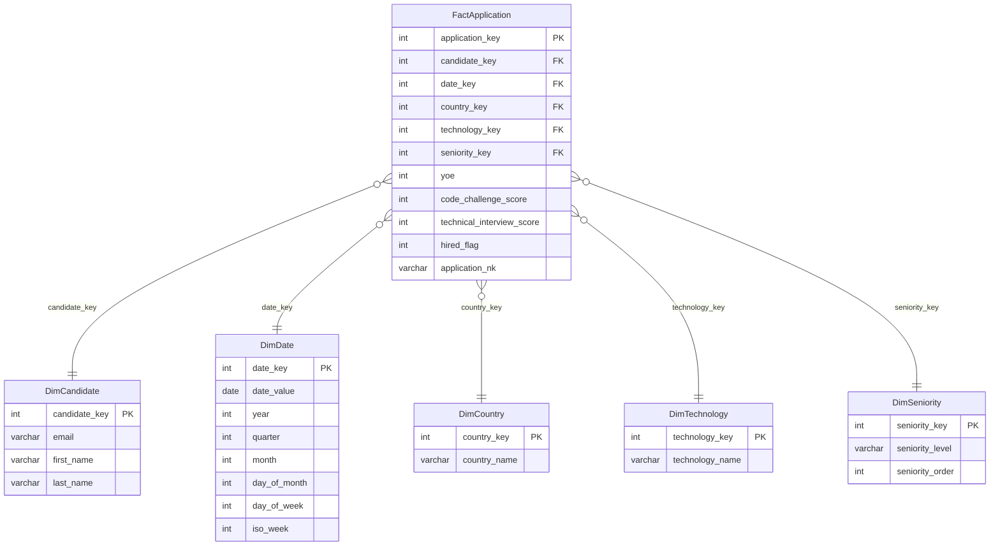

#  ETL Workshop — Recruitment Data Analysis

##  Project Description
This project implements a complete **ETL (Extract, Transform, Load) pipeline** using Python, MySQL, and Jupyter Notebook.  
The dataset represents **50,000 job applications** with attributes such as candidate information, application date, country, seniority, technology, and evaluation scores.  

The main objective was to **design a Data Warehouse with a Star Schema** and generate **KPIs and visualizations** to analyze recruitment trends.

---

##  ETL Pipeline

### 1. **Extract**
- Source: `candidates.csv` (semicolon separated)
- Tool: `pandas.read_csv`

### 2. **Transform** (Python + Pandas in Jupyter)
- Normalize column names (snake_case)
- Clean string fields
- Parse application dates
- Convert numeric fields (YOE, scores)
- Apply business rule:  
  `hired_flag = 1 if code_challenge_score >= 7 and technical_interview_score >= 7 else 0`
- Create natural key:  
  `application_nk = email + application_date`
- Sanity checks → 50,000 rows, 0 invalid dates, 13.4% hire rate

### 3. **Load** (MySQL with `mysql-connector-python`)
- **Star Schema** design:
  - **Dimensions**:  
    - `DimCandidate`  
    - `DimDate`  
    - `DimCountry`  
    - `DimTechnology`  
    - `DimSeniority`  
  - **Fact**:  
    - `FactApplication`  

---

##  Data Warehouse (Star Schema)


---

##  KPIs Implemented

1. **Hires by Technology** → Top-demand skills (Game Development, DevOps).  
2. **Hires by Year** → Stable until 2021, sharp drop in 2022.  
3. **Hires by Seniority** → Balanced distribution, slightly more entry-level.  
4. **Hires by Country** → Regional differences (Brazil leading but declining).  
5. **Global Hire Rate %** → Only 13.4% of candidates hired.  
6. **Average Scores by Technology** → Consistent performance across areas.

---

##  Visualizations
- **Bar Chart** → Hires by Technology  
- **Line Chart** → Hires by Year  
- **Pie Chart** → Hires by Seniority  
- **Multi-Line Chart** → Hires by Country over Time  
- **Grouped Bar Chart** → Average Scores by Technology  

---

##  Tech Stack
- **Python**: pandas, matplotlib, mysql-connector-python, sqlalchemy  
- **Database**: MySQL 8 (dbngin + Workbench)  
- **Notebook**: Jupyter  
- **Schema Design**: dbdiagram.io  

---

##  Conclusions
- The ETL pipeline was implemented successfully.  
- The Star Schema allowed efficient analytical queries.  
- KPIs and visualizations revealed meaningful insights about recruitment.  
- The global hire rate was very selective (~13%).  
- This project provided **hands-on experience in Data Engineering & Analytics**.  

---

## ▶ How to Run
1. Clone this repository:
   ```bash
   git clone https://github.com/yourusername/etl-workshop.git
   cd etl-workshop
   ```

2. Install dependencies:
   ```bash
   pip install -r requirements.txt
   ```

3. Start MySQL server (via dbngin or local instance).

4. Execute schema creation:
   ```bash
   mysql -u root -p < sql/ddl_star_schema.sql
   ```

5. Run Jupyter Notebook:
   ```bash
   jupyter notebook ETL_Workshop.ipynb
   ```

---

## ✨ Author
👩‍💻 Daniela Marín Villacorte  
_Data Engineering Student — Universidad Autónoma de Occidente_  
